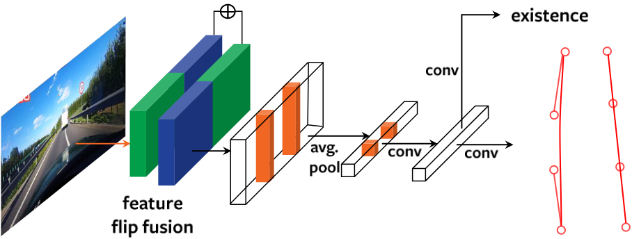

# Rethinking Efficient Lane Detection via Curve Modeling

([Arxiv 2203](https://arxiv.org/abs/2203.02431)) **BézierLaneNet:** Rethinking Efficient Lane Detection via Curve Modeling. [Zhengyang Feng](https://dblp.uni-trier.de/pid/263/3128.html) et al. [CVPR 2022](https://doi.org/10.1109/CVPR52688.2022.01655). [Code](https://github.com/voldemortX/pytorch-auto-drive)

## Abstract

This paper presents a novel parametric curve-based method for lane detection in RGB images. Unlike stateof-the-art segmentation-based and point detection-based methods that typically require heuristics to either decode predictions or formulate a large sum of anchors, the curvebased methods can learn holistic lane representations naturally. To handle the optimization difficulties of existing polynomial curve methods, we propose to exploit the parametric B ́ezier curve due to its ease of computation, stability, and high freedom degrees of transformations. In addition, we propose the deformable convolution-based feature flip fusion, for exploiting the symmetry properties of lanes in driving scenes. The proposed method achieves a new state-ofthe-art performance on the popular LLAMAS benchmark. It also achieves favorable accuracy on the TuSimple and CULane datasets, while retaining both low latency (>150 FPS) and small model size (<10M). Our method can serve as a new baseline, to shed the light on the parametric curves modeling for lane detection. Codes of our model and PytorchAutoDrive: a unified framework for self-driving perception, are available at: https://github.com/ voldemortX/pytorch-auto-drive.

## Results and Models

### Results on CuLane

| Architecture | Backbone |      F1@50      | F1@75 | mF1 | Config | Download |
| :-----------: | :-------: | :-------------: | ----- | --- | ------ | -------- |
| BezierLaneNet | ResNet-18 | 73.67*\| 73.12 |       |     |        |          |
| BezierLaneNet | ResNet-34 |   75.57*\| 7   |       |     |        |          |
| BezierLaneNet |  DLA-34  |                |       |     |        |          |

### Results on TuSimple

| Architecture | Backbone | F1@50 | F1@75 | mF1 | Config | Download |
| :-----------: | :-------: | :----: | ----- | --- | ------ | -------- |
| BezierLaneNet | ResNet-18 | 95.41* |       |     |        |          |
| BezierLaneNet | ResNet-34 | 95.65* |       |     |        |          |
| BezierLaneNet |  DLA-34  |        |       |     |        |          |

### Results on VIL-100

| Architecture | Backbone | F1@50 | F1@75 | mF1 | Config | Download |
| :-----------: | :-------: | :---: | ----- | --- | ------ | :------: |
| BezierLaneNet | ResNet-18 | 85.93 |       |     |        |          |
| BezierLaneNet | ResNet-34 |      |       |     |        |          |
| BezierLaneNet |  DLA-34  |      |       |     |        |          |

### Results on CurveLanes

| Architecture | Backbone | F1@50 | F1@75 | mF1 | Config | Download |
| :-----------: | :-------: | ----- | ----- | --- | ------ | -------- |
| BezierLaneNet | ResNet-18 |       |       |     |        |          |
| BezierLaneNet | ResNet-34 |       |       |     |        |          |
| BezierLaneNet |  DLA-34  |       |       |     |        |          |
